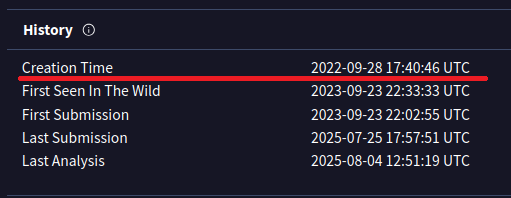
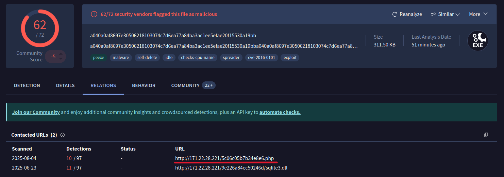
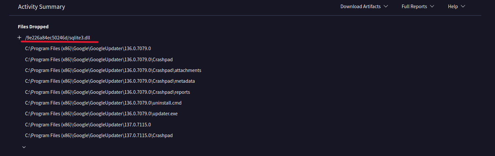
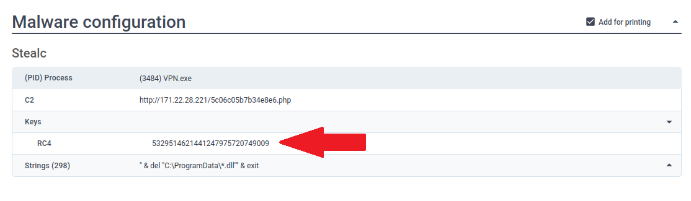
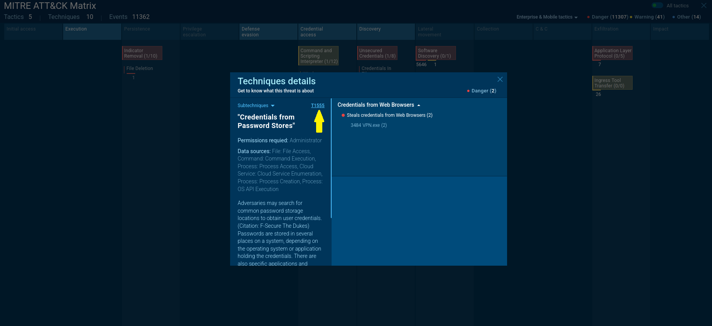
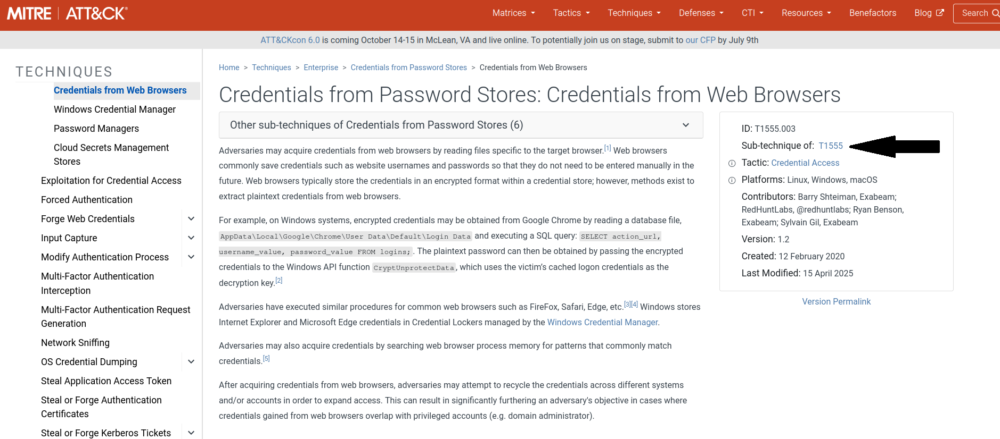
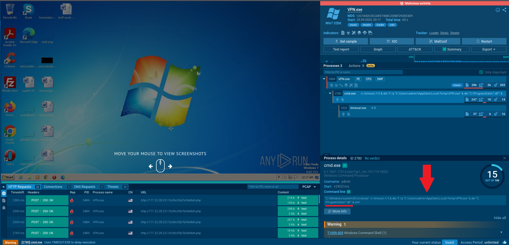
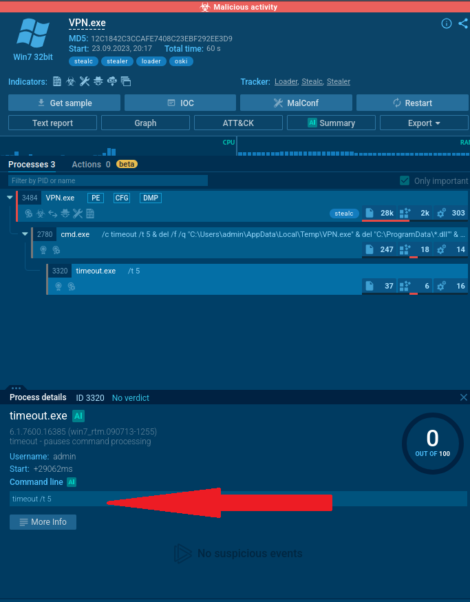

# 🛡️ Malware Analysis - CyberDefenders Lab's

## 🧪 Lab Overview

- **Lab Name**: Oski  
- **Category**: Threat Intelligence  
- **Tactics Covered**:
  - Initial Access
  - Execution
  - Defense Evasion
  - Credential Access
  - Command and Control
  - Exfiltration  

> **Scenario**: The accountant at the company received an email titled "Urgent New Order" from a client late in the afternoon. When he attempted to access the attached invoice, he discovered it contained false order information. Subsequently, the SIEM solution generated an alert regarding downloading a potentially malicious file. Upon initial investigation, it was found that the PPT file might be responsible for this download. Could you please conduct a detailed examination of this file?
---

## 🧩 Questions & Solutions

### Q1 — **Malware Creation Timestamp**

> 🕒 **Question**: Determining the creation time of the malware can provide insights into its origin. What was the time of malware creation?  

> 📅 **Answer**: `2022-09-28 17:40`

📌 _This timestamp was extracted from VirusTotal; go to the file’s Details tab and examine the History section, which reveal the creation time._
     
    

---

### Q2 — **C2 Server Identification**

> 🌐 **Question**: Identifying the command and control (C2) server that the malware communicates with can help trace back to the attacker. Which C2 server does the malware in the PPT file communicate with?  

> 📡 **Answer**: `http://171.22.28.221/5c06c05b7b34e8e6.php`

📌 _Check the file's network activity for outbound connections to URLs or IP addresses, as these may indicate communication with a command-and-control (C2) server. In VirusTotal, navigate to the Relations section and look for Contacted URLs._

---

### Q3 — **First Library Loaded**

> 📚 **Question**: Identifying the initial actions of the malware post-infection can provide insights into its primary objectives. What is the first library that the malware requests post-infection?  

> 📂 **Answer**: `sqlite3.dll`

📌 _Malware often loads specific libraries upon infection to perform malicious activities. In VirusTotal, go to the Behavior section ad then look for Files Dropped, you should find the associated DLL file._

---

### Q4 — **RC4 Key Detection**

> 🔑 **Question**: By examining the provided Any.run report, what RC4 key is used by the malware to decrypt its base64-encoded string?  

> 🧬 **Answer**: `5329514621441247975720749009`

📌 _The RC4 key used for encryption or decryption may be embedded in the malware configuration; dynamic analysis tools can sometimes reveal this key directly. We can check the Malware Configuration section for encryption keys, the RC4 key is often listed there if it’s part of the malware’s config._

---

### Q5 — **MITRE Technique - Credential Access**

> 🧠 **Question**: By examining the MITRE ATT&CK techniques displayed in the Any.run sandbox report, identify the main MITRE technique (not sub-techniques) the malware uses to steal the user’s password.  

> 🛠️ **Answer**: `T1555`

📌 _Mapped by analyzing MITRE ATT&CK techniques flagged automatically in ANY.RUN’s behavior report._

---

---

### Q6 — **Targeted Directory for DLL Deletion**

> 🗂️ **Question**: By examining the child processes displayed in the Any.run sandbox report, which directory does the malware target for the deletion of all DLL files?

> 📁 **Answer**: `C:\ProgramData`

📌 _Malware often deletes files to cover its tracks. We can check in the command-line execution captured in the sandbox timeline._

---

### Q7 — **Self-Deletion Timing**

> ⏳ **Question**: After exfiltrating the user’s data, how many seconds does it take for the malware to self-delete?  

> 🧨 **Answer**: `5 seconds`

📌 _Measured using the timeline of process execution in ANY.RUN sandbox._

---

## 🧰 Tools Used

- **VirusTotal** — Static analysis and community-based detection
- **ANY.RUN** — Dynamic analysis, process behavior, and MITRE mapping

---

## 🛡️ Detection & Mitigation

### 🔍 Detection Opportunities

- **Unusual PowerPoint Behavior**  
  - Alert when `.ppt` or `.pptx` files launch child processes (e.g., `cmd.exe`, `powershell.exe`).
  - Use YARA or Sigma rules to detect execution chains involving Office applications.

- **Outbound C2 Communication**
  - Monitor for HTTP requests to rare or unknown IPs with `.php` paths from user workstations.
  - Implement proxy or DNS logging with anomaly detection on uncommon external domains.

- **Access to Credential Stores (T1555)**
  - Monitor processes accessing `lsass.exe`, especially from non-privileged binaries.
  - Enable Windows Defender Credential Guard or use EDR solutions to detect memory scraping.

- **DLL File Deletion in Sensitive Paths**
  - Detect bulk or programmatic DLL deletion in `C:\\ProgramData\\`, which is abnormal for user behavior.
  - Use Sysmon to log `FileDelete` events in that directory.

- **Short-lived Binary (Self-deletion)**
  - Flag binaries that self-delete within seconds of execution (e.g., `timeout.exe` usage).
  - Use behavioral baselines to detect high-turnover temp executables.

---

### 🔐 Mitigation Strategies

- **Email Gateway Protection**
  - Enforce attachment sandboxing (e.g., via Proofpoint, FortiMail).
  - Block macros or embedded objects in Office files from unknown sources.

- **Application Control**
  - Use AppLocker or Windows Defender Application Control to restrict execution from `%TEMP%`, `%APPDATA%`, or `C:\\ProgramData`.

- **Least Privilege Enforcement**
  - Ensure users cannot escalate or execute code with elevated privileges.
  - Regularly review access to sensitive tools like `procmon`, `mimikatz`, etc.

- **Endpoint Protection (EDR/AV)**
  - Enable behavioral detection modules to catch C2 callbacks, process hollowing, or self-deleting binaries.
  - Configure alerts on LSASS memory access and suspicious command-line activity.

- **Incident Response Playbook**
  - Prepare a response flow for Office-based malware: isolate endpoint, preserve memory, extract artifacts, search IOCs.

---

## 📑 Applicable Standards and Frameworks

**MITRE ATT&CK:**  
- Relevant Tactics/Techniques: T1555 (Credential Access), Initial Access, Execution, Defense Evasion, Command and Control, Exfiltration

**NIST Cybersecurity Framework (CSF):**  
- Detect: DE.AE – Anomalies and Events Detection  
- Respond: RS.MI – Mitigation of Incidents

**ISO/IEC 27001 (Annex A):**  
- A.12.4 – Logging and Monitoring  
- A.16.1 – Information Security Incident Management

## 🧾 Conclusion

This write-up documents a full malware analysis workflow using public sandbox environments and common threat intel tools. It highlights how to extract indicators, interpret malware behavior, and map findings to frameworks like MITRE ATT&CK — skills essential for an entry-level SOC analyst.

---

## 📁 Author

**Juan Capitán** – Cybersecurity Analyst  

