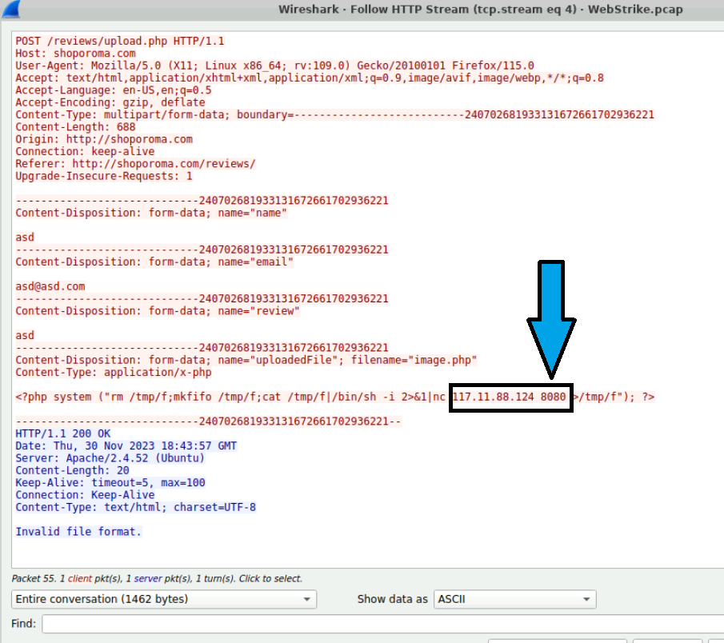

# 🛡️ Network Security - CyberDefenders Lab's

## 🧪 Lab Overview

- **Lab Name**: WebStrike  
- **Category**: Network Forensics  
- **Tactics Covered**:
  - Initial Access
  - Execution
  - Persistence
  - Command and Control
  - Exfiltration  

> **Scenario**: A suspicious file was identified on a company web server, raising alarms within the intranet. The Development team flagged the anomaly, suspecting potential malicious activity. To address the issue, the network team captured critical network traffic and prepared a PCAP file for review.
Your task is to analyze the provided PCAP file to uncover how the file appeared and determine the extent of any unauthorized activity.

---

## 🧩 Questions & Solutions

### Q1 — **IP Geolocation service**

> 🕒 **Question**: Identifying the geographical origin of the attack facilitates the implementation of geo-blocking measures and the analysis of threat intelligence. From which city did the attack originate?  

> 📅 **Answer**: `Tianjin`

📌 _First look at the source and destination IP addresses in the PCAP file, then filter for HTTP GET requests using the filter: http.request.method == GET identifing the source IP address associated with the request and finally use a geo-IP lookup service to identify source IP._
     
    

---

---

### Q2 — **Attacker full User-Agent**

> 🌐 **Question**: Knowing the attacker's User-Agent assists in creating robust filtering rules. What's the attacker's Full User-Agent? 

> 📡 **Answer**: `Mozilla/5.0 (X11; Linux x86_64; rv:109.0) Gecko/20100101 Firefox/115.0`

📌 _Filter for HTTP GET requests using http.request.method == GET. Expand the Hypertext Transfer Protocol section in a GET packet and find the User-Agent field to view the attacker's User-Agent string._

---

### Q3 — **Malicius Web-Shell**

> 📚 **Question**: We need to determine if any vulnerabilities were exploited. What is the name of the malicious web shell that was successfully uploaded?  

> 📂 **Answer**: `image.jpg.php`

📌 _Use the filter: http.request.method == POST. Then, analyze the HTTP POST packets by following the HTTP stream. To follow the HTTP stream, Right-click on the selected packet and select Follow > HTTP Stream to view the conversation. After following the HTTP stream, observe the uploaded file name. Note that two upload attempts were made._

---

### Q4 — **Detection of file's location**

> 🔑 **Question**: Identifying the directory where uploaded files are stored is crucial for locating the vulnerable page and removing any malicious files. Which directory is used by the website to store the uploaded files? 

> 🧬 **Answer**: `/reviews/uploads/`

📌 _Apply the filter http.request.uri contains "<Uploaded_Filename>" and analyze the packet's HTTP URI to locate the upload directory._

---

### Q5 — **Port of targeted machine**

> 🧠 **Question**: Which port, opened on the attacker's machine, was targeted by the malicious web shell for establishing unauthorized outbound communication?

> 🛠️ **Answer**: `Port 8080`

📌 _Apply http.request.method == POST, right-click the POST packet, and select "Follow > HTTP Stream" to view the uploaded file content. Use tcp.stream eq 4.._

---

### Q6 — **Searching for Compromised Data**

> 🗂️ **Question**: Recognizing the significance of compromised data helps prioritize incident response actions. Which file was the attacker attempting to exfiltrate?

> 📁 **Answer**: `passwd`

📌 _Apply the filter: tcp.dstport == <Detected_Port>. Follow the TCP stream to identify any file names or commands indicating data being exfiltrated._

---

## 🧰 Tools Used

- **Wireshark**: Wireshark is a network protocol analyzer used for traffic inspection.

---

## 🧾 Conclusion

This network forensics investigation successfully reconstructed the full attack chain — from initial access to data exfiltration — using the captured PCAP file. Leveraging Wireshark, key indicators of compromise were identified, including:

The attacker’s source IP and its geolocation, aiding in threat attribution and geo-blocking.

The User-Agent string, which revealed the use of a Linux-based browser likely tied to an automated tool.

The successful upload of a disguised web shell (image.jpg.php) via an HTTP POST request.

The upload directory path (/reviews/uploads/), highlighting a server misconfiguration or file upload vulnerability.

The unauthorized outbound communication to port 8080, indicating remote command execution.

The attempt to exfiltrate sensitive data, such as the system’s passwd file.

This case illustrates the critical role of packet-level inspection in uncovering malicious activity and highlights the importance of applying detection strategies aligned with the MITRE ATT&CK framework. For entry-level SOC analysts, mastering tools like Wireshark and understanding HTTP-based attacks are essential skills in identifying and responding to real-world threats.

---

## 🛡️ Detections and Mitigations

### 🔍 Detections

| Indicator                        | Detection Method                                      | Tool/Filter Used                                 |
|----------------------------------|-------------------------------------------------------|--------------------------------------------------|
| Suspicious HTTP GET requests     | Inspect HTTP method and headers                       | `http.request.method == GET`                     |
| Attacker’s User-Agent            | Analyze User-Agent header in HTTP GET                 | Expand HTTP headers in Wireshark                 |
| Malicious file upload            | Monitor HTTP POST with file upload indicators         | `http.request.method == POST` + Follow stream    |
| Web shell filename (`.php`)      | Detect double extension files in HTTP POST requests   | Look for `.php` in filenames                     |
| Upload directory discovered      | URI inspection of POST requests                       | `http.request.uri contains "image.jpg.php"`      |
| Outbound connection to port 8080 | Observe unauthorized outbound TCP connections         | `tcp.stream eq <stream_id>`                      |
| Data exfiltration attempt        | Look for commands targeting sensitive files           | TCP stream analysis                              |   

---

### 🔐 Mitigations

| Risk / Tactic                        | Mitigation Strategy                                                                 |
|-------------------------------------|--------------------------------------------------------------------------------------|
| File upload vulnerability           | Validate file extensions server-side and implement allow-lists                       |
| Web shell execution                 | Disable script execution in upload directories (e.g., disable `.php`)                |
| Initial access via HTTP             | Use WAF to block suspicious requests and inspect payloads                            |
| User-Agent spoofing                 | Log and alert on uncommon or suspicious User-Agents                                  |
| Lack of geo-blocking                | Apply IP filtering or geo-blocking for regions with no business relevance            |
| Command & Control via custom port   | Restrict outbound connections and monitor non-standard ports                         |
| Data exfiltration                   | Monitor outbound traffic for sensitive file patterns or large transfers              |
| Persistence via web shell           | Regular file integrity monitoring and automated web root scans                       |

---

### 📘 Recommended Defenses (Mapped to MITRE ATT&CK)

| Tactic              | Technique                         | Control                                                                 |
|---------------------|-----------------------------------|-------------------------------------------------------------------------|
| Initial Access      | T1190 - Exploit Public-Facing App | Regular patching, WAF, input validation                                 |
| Execution           | T1059 - Command Scripting         | Disable unnecessary scripting engines, monitor execution logs           |
| Persistence         | T1505 - Server Software Component | Restrict upload locations, perform web directory scanning               |
| Command and Control | T1071.001 - Web Protocols         | Analyze traffic patterns, restrict outbound HTTP from servers           |
| Exfiltration        | T1041 - Exfiltration Over C2      | DLP solutions, inspect outbound traffic                                 |

---

## 📁 Author

**Juan Capitán** – Cybersecurity Analyst  
